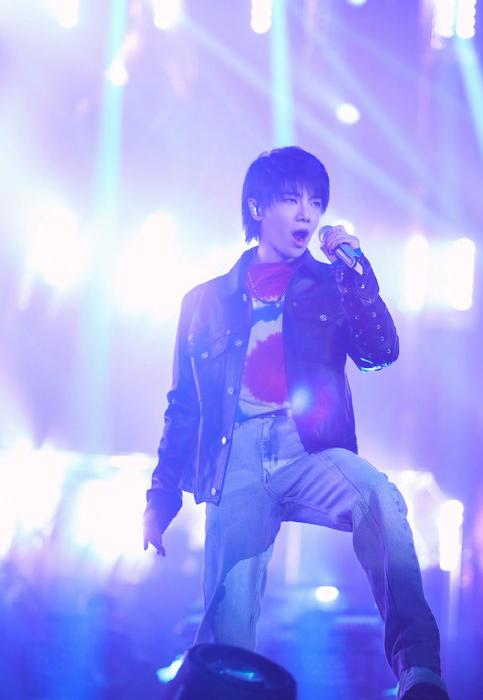
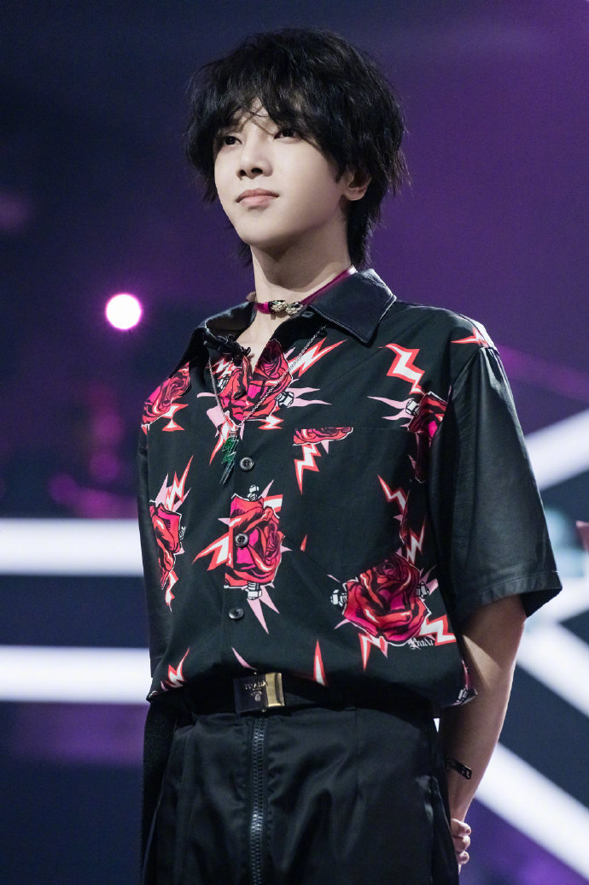

# 华晨宇

## 个人简介

华晨宇（1990年2月7日－），湖北十堰人，为中国大陆流行男歌手、音乐创作人。毕业于武汉音乐学院演艺学院通俗声乐演唱与编导专业。

## 重要事件

- 2013年,参加选秀节目《快乐男声》获全国总冠军出道。
- 2014年1月，首登央视春晚；同年九月连开两场个人品牌“火星演唱会”,成为华语首位出道未满一年连开万人场个人演唱会的歌手。2015年首登福布斯中国名人榜。2016年参加中国内地首档星素同台竞技音乐节目《天籁之战》，展现出于24小时内改编神曲的极强编曲能力；同年获2016MAMA亚洲最佳艺人奖。
- 2018年,参加湖南卫视《歌手2018》,四次获得单场赛冠军，并获总决赛亚军；同年九月于北京鸟巢连开两场火星演唱会，成为90后新生代首位于鸟巢开唱；中国首位于鸟巢连开两场个唱的歌手；2015年发行的第二张个人专辑《异类》获得2018五大金榜唱片销售排行年度冠军。
- 2019年,成为首位开启体育场四面台的内地歌手；同时也是中国首位连开三场体育场四面台个人演唱会的新生代歌手。
- 2019年11月15-17日，华晨宇火星演唱会在海口五源河体育场连唱三天，三天累计动员15万人次，嗨爆五源河。
- 2019年,音域F2-B5。
- 2020年参加《歌手2020》与《王牌对王牌》节目录制。

## 主要作品

| 发行时间       | 专辑名              | 曲目               |
| -------------- | ------------------- | ---------------- |
| 2014年9月17日  | 《卡西莫多的礼物》  | Why Nobody Fights（词/曲：华晨宇）  微光 Let You Go（曲：华晨宇）  烟火里的尘埃  拆弹专家  环游  我们都是孤独的  不朽  卡西莫多的礼物（曲：华晨宇） 枕边故事 |
| 2015年12月15日 | 《异类》            |  我管你（曲：华晨宇） 国王与乞丐(与杨宗纬)蜉蝣（曲：华晨宇） 反义词 异类（曲：华晨宇） 逃离乌托邦 世界是个动物园（曲：华晨宇） 变相怪杰（曲：Takuya/Jimmy Fung/林承佑/华晨宇） 写给未来的孩子（曲：华晨宇） 地球之盐（曲：华晨宇） 忧伤的巨人（曲：华晨宇） |
| 2017年3月14日  | 《H》               | Here We Are（曲：华晨宇） 巨鹿（曲：华晨宇） To Be Free（曲：华晨宇） For Forever（曲：华晨宇） 我离孤单几公里（曲：华晨宇） 消失的昨天 造物者（曲：华晨宇） 我的滑板鞋2016（曲：华晨宇/约瑟翰·庞麦郎） |
| 2020年4月8日   | 《新世界NEW WORLD》 | 斗牛（曲：华晨宇） 好想爱这个世界啊（曲：华晨宇） 疯人院（曲：华晨宇） 与火星的孩子对话（曲/词：华晨宇） 七重人格（曲：华晨宇） 神树（曲：华晨宇） 降临（曲：华晨宇） 新世界（曲：华晨宇） |

## 成就和荣誉

1. 2019-12-14 2019神武·第十三届音乐盛典咪咕汇 年度内地最受欢迎男歌手
2. 2019-12-14 2019神武·第十三届音乐盛典咪咕汇 年度最佳男歌手
3. 2019-01-11 2018微博之夜年度最佳歌手
4. 2018-12-13 2018《芭莎男士》商业星力量年度盛典 年度最佳歌手
5. 2018-08-29 2018华人歌曲音乐盛典 华人杰出青年歌手
6. 2017-12-03 2017腾讯视频星光大赏 VIP年度歌手
7. 2017-12-02 2018爱奇艺尖叫之夜 年度男歌手
8. 2016-12-18 网易有态度人物盛典 年度最有态度燃爆唱将
9. 2016-12-02 MAMA（Mnet亚洲音乐大奖） 亚洲最佳艺人（中国）
10. 2016-09-27 亚洲新歌榜2016年度盛典 最佳男歌手
11. 2016-04-13 2016乐视生态共享之夜 年度最受欢迎歌手
12. 2016-03-29 2016酷亚洲音乐盛典 年度最具影响力歌手
13. 2016-03-29 2016酷亚洲音乐盛典 现场人气歌手
14. 2016-03-28 第23届东方风云榜 全民选择男歌手
15. 2016-03-28 第23届东方风云榜 传媒推荐奖
16. 2016-01-16 阿里音乐年度人气榜 年度最受欢迎艺人
17. 2016-01-12 2015移动视频风云盛典 最具人气男歌手
18. 2016-01-07 2015微博之夜 年度最受欢迎男歌手
19. 2016-01-07 2015微博之夜 2015亚洲新歌榜冠军王
20. 2015-08-23 2014Music Radio中国排行榜 年度最受欢迎新人
21. 2015-04-13 第十五届音乐风云榜年度盛典 2014年度最受欢迎男歌手（内地）
22. 2015-03-30 第22届东方风云榜 全民选择男歌手
23. 2015-03-25 2015QQ音乐年度盛典暨巅峰榜颁奖典礼 年度最佳内地男歌手
24. 2015-03-25 2015QQ音乐年度盛典暨巅峰榜颁奖典礼 年度最佳QQ音乐互动演唱会
25. 2015-02-02 2014第四届阿比鹿音乐奖 最受欢迎流行音乐人
26. 2015-01-17 腾讯应用宝“星app之夜”年度盛典 年度最佳男歌手
27. 2014-12-31 第二届乐动·微乐迷流行音乐 最佳男歌手
28. 2014-12-31 2014蜻蜓空中音乐榜年度盛典 最受欢迎男歌手
29. 2014-12-30 第15届华语音乐传媒大奖 百家传媒最受瞩目男歌手
30. 2014-12-23 Hi歌年度盛典 年度Hi歌 《春》
31. 2014-12-06 尖叫2015爱奇艺之夜 互联网最受欢迎歌手
32. 2014-03-31 第21届东方风云榜 最佳新锐歌手奖
33. 2014-01-18 直通春晚 全国四强
34. 2013-12-06 第六届音乐风云榜新人盛典 最受欢迎男歌手
35. 2013-09-27 2013年快乐男声 全国总冠军

## 生活照

## 星路历程

### 早年经历

1990年2月7日，华晨宇出生于湖北十堰。他从小就开始接触音乐。小学五年级之前，长笛是华晨宇的最爱。随着年龄增长，他不再满足于长笛带给他的音乐世界，与父亲交流并获得支持后，华晨宇开始学钢琴，虽然过程并不是一帆风顺，但凭着自身的努力，他很快达到了钢琴十级。

初中毕业时，华晨宇已经对自己的未来有了规划，他想学更多的音乐知识，想去武汉上高中。2009年，华晨宇参加了高考。一心想上武汉音乐学院的他，专业课满分，却因为文化课的一分之差与心仪的高等学府失之交臂。但他坚持复读也一定要考上武汉音乐学院。第二年即以文化课高出20多分，专业课优秀的成绩，顺利进入武汉音乐学院学习音乐。

### 演艺经历

2013年6月29日，快乐男声长沙唱区十强决选现场，华晨宇凭借原创的《无字歌》全票晋级长沙唱区10强，也因此被称为“火星弟弟”。9月27日，华晨宇以1606的总分夺得2013快乐男声全国总冠军，签约天娱传媒。同年9月，首支个人单曲《我和我》曝光，收录于2013快男合辑《追梦敢不敢》。2013年11月2日-2014年3月15日，2013快乐男声全国巡回演唱会先后在北京、上海、杭州等11大城市举办。2013年11月16日-2014年1月18日，代表湖南卫视参加2013直通春晚，并成为首位获得2014央视马年春晚邀请函的选手。

2014年1月30日，首登央视春晚舞台并献唱《在那遥远的地方》。1月31日，在2014北京卫视春晚演唱《We are young》。4月，加盟湖南卫视明星户外旅行真人秀节目《花儿与少年》，节目首播收视率即夺得同时段冠军。6月28日，华晨宇2014火星演唱会开票，1分32秒售罄，多方协商后决定加场。6月，为世界级男性杂志《智族GQ》七月号拍片并接受专访。9月6日至7日，华晨宇2014“火星”演唱会在北京万事达中心连开两场。9月6日，QQ音乐与芒果TV同步直播火星演唱会，开创明星演唱会O2O多屏直播互动模式新纪元，创多个行业新纪录。9月19日，华晨宇首专《卡西莫多的礼物》内地及海外版同步发行。专辑曲风多样，以第一人称“我”来叙述，讲述“我”对于自己、对于世界的感受。专辑内地版登京东年度音乐销量榜第一，海外版发行后在台湾五大唱片榜蝉联冠军。11月24日，《HI歌》第四期播出，华晨宇演绎的《春》广受好评并最终成为年度Hi歌。

2015年1月1日，加盟辽宁卫视新年欢唱会并献唱。2月8日（洛杉矶当地时间），受Billboard邀请作为VIP观礼嘉宾出席第57届格莱美颁奖典礼。2月17日，参加辽宁卫视春晚。4月27日，原创的人声实验作品《癌》全网上线。5月11日，2015福布斯中国名人榜公布，华晨宇首次上榜，综合排名91。5月23日，火星演唱会8月1日场在大麦正式开票，当天在线人数达16万人，仅35秒即抢空，创线上售票新纪录，后追加两场。7月31日—8月2日，2015火星演唱会在上海大舞台连开三场，成为内地新声代第一人。8月1日，演唱会在腾讯视频和芒果TV线上直播，腾讯视频预约人数超20万，直播在线观看人数达264万，再创线上直播新纪录。9月27日，受邀参加央视中秋晚会。10月28日，第二张专辑《异类》实体专辑在京东开启限量预售，上架仅一天，夺下销量日榜，周榜，月榜冠军。11月7日，首张数字专辑预售上线8分钟突破10万销量记录。11月13日，国内首档音乐游学类真人秀《唱游天下》开播。12月18日，《异类》在海外各大数字音乐平台上线。12月22日，《异类》海外版正式上架。12月31日，加盟湖南卫视跨年晚会。

2016年1月7日，出席2015新浪微博之夜，斩获年度最受欢迎男歌手及2015亚洲新歌榜冠军王两项大奖。1月8日，加盟《郎朗的天空》新春国际音乐盛典，并于2月1日在辽宁卫视播出。2月8日，在北京春晚献唱《写给未来的孩子》。3月4日，在《王牌对王牌》第六期改编的《菠萝菠萝蜜》广受好评。3月7日，为电影《睡在我上铺的兄弟》献唱的插曲《横冲直撞》发布。4月7日，为《火星情报局》献唱同名主题曲。4月9日，作为代言人出席第十六届音乐风云榜，获年度最佳专辑演唱和年度最佳偶像两项大奖。5月8日，出席北京大学生电影节，首唱《横冲直撞》。7月1日，加盟《奔跑吧兄弟》第四季最后一期。7月2日，2016火星演唱会开启，北京站在乐视体育生态中心举办，成为内地新声代首位开四面台的歌手。8月21日上海站，9月16日深圳站，在乐视视频开启同步直播，总观看人数突破430万。7月8日，为电影《使徒行者》献唱主题曲《HereWeAre》。9月27日，出席亚洲新歌榜2016年度盛典，揽获最佳男歌手奖。10月16日，东方卫视《天籁之战》首播，华晨宇作为明星导师接受素人挑战，在节目中改编的《我的滑板鞋2016》被收录到第三张专辑。12月2日，获2016MAMA亚洲最佳艺人（中国区）奖。12月18日，获网易有态度人物盛典年度最有态度燃爆唱将。12月21日，出席2016优酷盛典，揽获年度突破艺人和微博加油榜·年轻的选择两项大奖。

2017年1月1日，献唱2016国剧盛典。3月14日，三专《H》京东限量发行。3月23日，六神公布华晨宇成为品牌形象代言人。4月17日，为《花儿与少年第三季》创作的主题曲《寻》正式发布。5月1日，加盟上海草莓音乐节。6月2日，电影《悟空传》主题曲《齐天》曝光，由华晨宇创作并演唱。6月3日，再次参加户外旅行真人秀节目《旅途的花样》。6月10日，华晨宇担任导师的《明日之子》在腾讯视频开播。7月8日，作为代言人出席珠江纯生“生·非凡”生啤酒派对。7月13日，雅诗兰黛确认华晨宇为其品牌大使。9月27日，为王者荣耀创作鲁班七号角色主题曲《智商二五零》。10月13日-14日，2017火星演唱会在北京五棵松体育馆连开两场。10月15日，《天籁之战》第二季开播。11月25日，接受素人挑战将游戏BGM改编为《代号魂斗罗》。

2018年2月，作为首位补位歌手加盟《歌手2018》，并获总决赛亚军。6月，作为代言人出席三星新品发布会。6月30日，再次出任《明日之子第二季》星推官。6月23日，2018鸟巢演唱会开票，1分56秒售罄，随即宣布加场，加场门票以2分58秒的速度再次秒空。8月29日，《斗破苍穹》主题曲《寒鸦少年》全网发布。8月29日，获2018华人歌曲音乐盛典“华人杰出青年歌手”奖。9月8日—9日，成为首位在鸟巢体育场连开两场个人演唱会的歌手。

2019年2月1日，担任浙江卫视《王牌对王牌第四季》固定MC。6月8日，作为表演嘉宾助阵《创造营2019》总决赛。6月15日，担任《明日之子水晶时代》的“明日星推官”。7月28日，加盟《极限挑战》第五季公益演唱会。10月28日，华晨宇出道六年来创作的第一首对唱歌曲《与火星的孩子对话》正式发布。11月15日-17日，华晨宇火星演唱会在海口五源河体育场连开3场。12月4日，《好想爱这个世界啊》数字单曲在网易云音乐独家开售，上线20天刷新全网销量最高的数字单曲纪录。

2020年2月7日，作为首发嘉宾加盟湖南卫视音乐竞技节目《歌手·当打之年》。2月21日，担任综艺节目《王牌对王牌第五季》固定王牌MC。4月8日14时07分，发行第四张个人专辑《新世界NEWWORLD》 ，该专辑共收录8首华晨宇的原创作品，华晨宇亦在专辑中担任总监制。